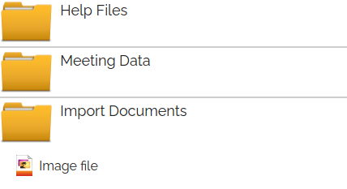
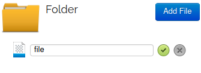

# Organise Files Into Folders

## Folder view collapesed

## Folder view expanded

## Multiple Folders

## Folder view in edit mode

---

### In edit mode you can upload files, remove files & change the file names.